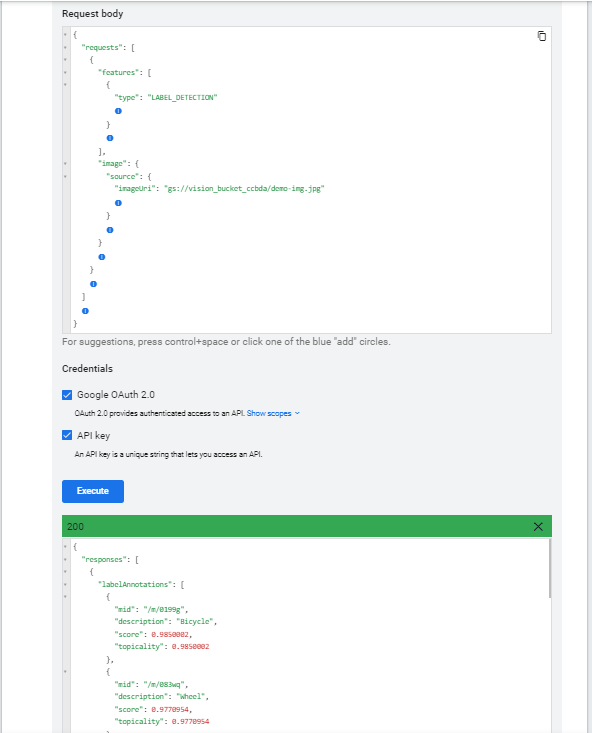

# 2024-7-7
Repo for 2024-7-7, Johannes Kari Solmundarson, Dmitry Chukhray

## Setting up the Google Account
Pretty straight forward. I don't know why the tutorial on https://cloud.google.com/vision/docs/detect-labels-image-api doesn't 
specify that the bucket should allow public access to items and that it should be finegrained access control, since that is the 
configuration required to follow the tutorial. 

It is super annoying to follow the tutorial with multiple google accounts logged in the browser. The default one (in my case my 
personal one) is the one that is selected every time you click a link in the tutorial, and sometimes when you try to switch, you
get redirected to some generic welcome page. 

Creating the service account key is not really described correctly in the tutorial. 

After completing all the steps we could test the api: 

## Python environment setup
We used PyCharms run configurations to add environment variables.

## Classify images
Since we cannot scrape Twitter without a scraper that can render javascript, we settled with scraping images from 
[Reuters](https://www.reuters.com/) and [Icelandic newspaper](https://www.visir.is). We analyzed them from three perspectives using the Google Cloud Vision, LABEL_DETECTION, 
LOGO_DETECTION and LANDMARK_DETECTION. For the ImageAnalyzer script to work as expected the URL parameter should be set/given as https://www.reuters.com/. The scraped images from the Icelandic newspaper by spider script can be used as input for the ImageAnalyzer script. In that case function *download_images* is not needed, same goes for the script's parameter. The following histogram can give a user an idea about what is on the news today
based on the images in the articles. 

